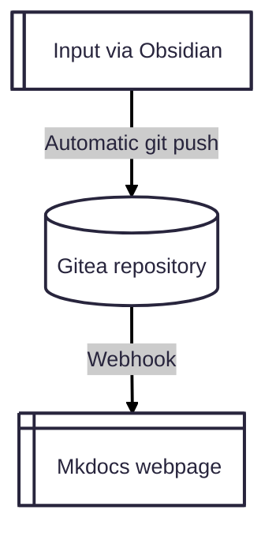

# obsidian-gitea-mkdocs

An automated, self-hosted documentation pipeline that synchronization local Obsidian vaults with a Gitea server, triggering immediate Webhook builds to serve elegant Markdown-based websites via MkDocs.

As soon as a document is updated locally, it is pushed to an internal Git server. This guarantees backups, version control, and full traceability. Concurrently, a Gitea webhook triggers a server-side script to automatically rebuild the webpage, providing a historic log of your files and an easy-to-navigate portal for the end user.

##How It Works

   Authoring: Users write technical notes inside Obsidian on their local machines.

   Synchronization: The Obsidian Git plugin automatically tracks changes and runs background commits/pushes (or instantly via dedicated hotkeys).

   Automation: Gitea catches the push and fires a Webhook to the documentation server.

   Deployment: A optimized Bash script acts as the webhook listener: it handles folder organization, injects custom CSS, blinds layout files (workspace.json), and commands MkDocs to build a static html portal in seconds.

##Prerequisites

This architecture assumes a self-hosted environment where Gitea and MkDocs reside on the same Linux server (e.g., Debian/Ubuntu), and users author content locally.
1. Server-Side Requirements

    Gitea Server: A running instance with administrator access (to configure webhooks).

    Python 3 & Pip: Required to isolate MkDocs inside a virtual environment.

    Web Server: Nginx or Apache configured to serve the static files folder (e.g., /var/www/frida).

   

Installing Dependencies & MkDocs Extensions:

To leverage all the features of this pipeline (like highlighter support, multi-page layout, and absolute roaming links), install MkDocs along with its essential plugins:

# Install system packages
sudo apt update && sudo apt install git python3 python3-pip python3-venv jq -y

# Setup virtual environment for MkDocs
python3 -m venv venv-mkdocs
source venv-mkdocs/bin/activate

# Install MkDocs, Themes, and Extensions
pip install mkdocs mkdocs-awesome-pages-plugin mkdocs-roamlinks-plugin

2. Client-Side Requirements (User's Machine)

    Obsidian: Installed on the local machine.

    Obsidian Git Plugin: Installed via Community Plugins.

    Gitea Access Token: An active personal access token to allow seamless authentication from local scripts and plugins.

🛠️ Deployment & Project Structure

To make this ecosystem production-ready, this repository provides two core automation scripts:
A. The Client-Side Sync Script (sync-local-wikis.sh)

Located in the client/ folder, this script runs on the users' machines. It fetches all repositories from your Gitea Organization automatically, handles the initial clone, and injects a bulletproof .gitignore policy locally to prevent file locking conflicts (workspace.json).

B. The Server-Side Webhook Listener (webhook-builder.sh)

Located in the server/ folder, this script is executed whenever Gitea receives a push. It handles concurrency locks, structures the MkDocs environment, and runs isolated or portal-wide rebuilds.

Git Ignore Policy (Crucial)

Obsidian creates highly dynamic cache files under the .obsidian/ directory (such as workspace.json and graph.json). To prevent constant merge conflicts between team members, our client-side automation guarantees the following rule enforcement:

.obsidian/workspace.json
.obsidian/workspace
.obsidian/graph.json
.obsidian/plugins/obsidian-git/queue.json

Distributed under the MIT License. See LICENSE for more information.
