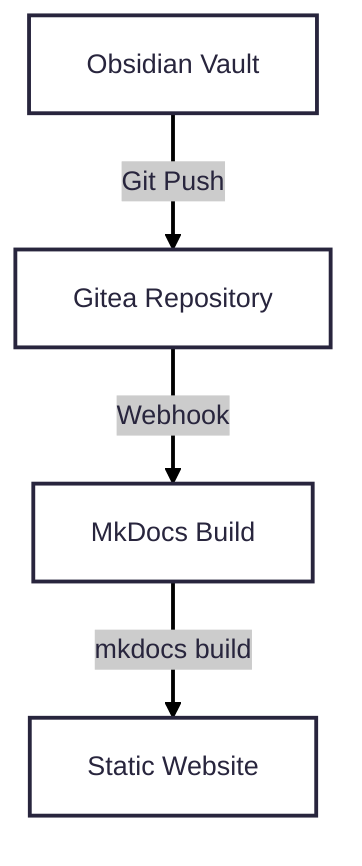

# obsidian-gitea-mkdocs

[](https://gitea.io/)
[](https://www.mkdocs.org/)
[](https://obsidian.md/)
[](https://opensource.org/licenses/MIT)

A self-hosted documentation pipeline that integrates Obsidian, Gitea, and MkDocs.

Documentation is authored locally in Obsidian, synchronized with Gitea repositories, and automatically published through MkDocs whenever a repository receives a push event.

---

## Architecture



---

## Workflow

1. Documentation is created or updated in an Obsidian vault.
2. Changes are committed and pushed to Gitea using the Obsidian Git plugin or the synchronization script.
3. Gitea sends a webhook request to the documentation server.
4. The server synchronizes the repositories and executes `mkdocs build`.
5. The generated site is published by the configured web server.

---

## Repository Structure

```text
.
├── client/
│   └── sync-local-wikis.sh
├── server/
│   └── webhook-builder.sh
├── template/
│   ├── index.md
│   └── .obsidian/
└── README.md
```

| Directory | Description |
|-----------|-------------|
| `client/` | Client-side synchronization scripts. |
| `server/` | Server-side build and deployment scripts. |
| `template/` | Template repository used to create new documentation repositories. |

---

## Requirements

### Server

- Linux (Debian/Ubuntu or compatible)
- Git
- Python 3
- Python Virtual Environment (`venv`)
- Gitea
- MkDocs
- Nginx or Apache

### Client

- Obsidian
- Obsidian Git community plugin
- Personal Access Token for Gitea

---

## Installation

### Install system packages

```bash
sudo apt update

sudo apt install \
    git \
    python3 \
    python3-pip \
    python3-venv \
    jq -y
```

### Create the Python virtual environment

```bash
python3 -m venv venv-mkdocs
source venv-mkdocs/bin/activate
```

### Install MkDocs and plugins

```bash
pip install \
    mkdocs \
    mkdocs-awesome-pages-plugin \
    mkdocs-roamlinks-plugin
```

---

## Components

### Client Synchronization

The `client/sync-local-wikis.sh` script:

- Retrieves repositories from the configured Gitea organization.
- Clones repositories that do not exist locally.
- Updates existing repositories.
- Applies the project's Git ignore policy.

See `client/README.md` for configuration details.

### Server Build

The `server/webhook-builder.sh` script:

- Receives webhook requests.
- Prevents concurrent builds using `flock`.
- Synchronizes local repositories.
- Removes obsolete repositories from the documentation tree.
- Executes `mkdocs build`.
- Publishes the generated site.

See `server/README.md` for deployment instructions.

### Repository Template

The `template/` directory contains the base repository used when creating new documentation projects.

It includes:

- Initial documentation structure.
- Recommended Obsidian configuration.
- Default repository layout.

See `template/README.md` for details.

---

## Git Ignore Policy

The client synchronization script excludes user-specific Obsidian files to reduce merge conflicts.

```gitignore
.obsidian/workspace.json
.obsidian/workspace
.obsidian/graph.json
.obsidian/plugins/obsidian-git/queue.json
```

---

## Deployment

1. Configure the template repository in Gitea.
2. Deploy the server-side build script.
3. Configure a webhook for push events.
4. Run the client synchronization script on user workstations.
5. Open the generated MkDocs site through the configured web server.

---

## License

This project is distributed under the MIT License.

See the `LICENSE` file for details.
